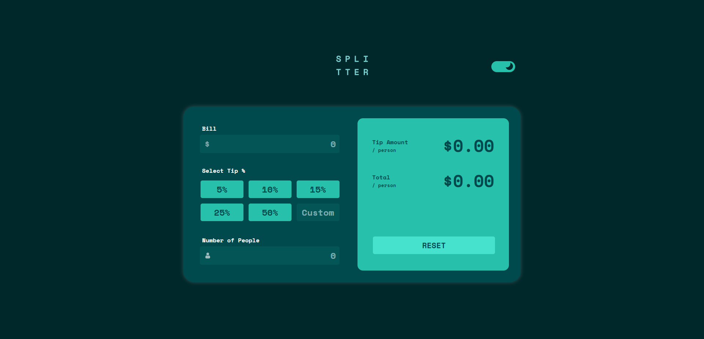

# Frontend Mentor - Tip calculator app solution

This is a solution to the [Tip calculator app challenge on Frontend Mentor](https://www.frontendmentor.io/challenges/tip-calculator-app-ugJNGbJUX). Frontend Mentor challenges help you improve your coding skills by building realistic projects.

## Table of contents

- [Overview](#overview)
  - [The challenge](#the-challenge)
  - [Screenshot](#screenshot)
  - [Links](#links)
- [My process](#my-process)
  - [Built with](#built-with)
  - [What I learned](#what-i-learned)

## Overview

### The challenge

Users should be able to:

- View the optimal layout for the app depending on their device's screen size
- See hover states for all interactive elements on the page
- Calculate the correct tip and total cost of the bill per person
- Viw calculator app in both day and night mode

### Screenshot

- Default: 

- Night mode: 

### Links

- Solution URL: [https://github.com/Jo-cloud85/tip-calculator-app.git](https://github.com/Jo-cloud85/tip-calculator-app.git)
- Live Site URL: [https://jo-cloud85.github.io/tip-calculator-app/](https://jo-cloud85.github.io/tip-calculator-app/)

## My process

### Built with

- Semantic HTML5 markup
- CSS custom properties
- Flexbox
- CSS Grid
- Mobile-first workflow
- [Styled Components](https://styled-components.com/) - For styles

### What I learned

1. toFixed() - to limit your output to your desired decimal places
2. $NaN & $Infinity - to handle these errors when they get thrown when input(s) is missing
3. outer/inner-spin button - this is a CSS portion where one is able to hide the up and down button for input type of 'number'.
4. day & night mode - although this is not a requirement of this challenge, I like to give it a try. Most of the steps are in CSS with only the trigger written in the Js file.
5. bind() method - to add the handler function into 2 types of tipInput, one usually does it like this:

//
customTipBtn.addEventListener("input", () => {
handler(customTipBtn);
});
//

However, a shorter way is to use the bind() method which returns a new function that can be used as the event listener function for the input event. The first argument to bind() is null because the this value is not used inside the calculateTipAmounts() function.

By using bind() to create the event listener function, you can pass the customTipBtn element as a parameter to handler() without the need for an anonymous arrow function.
